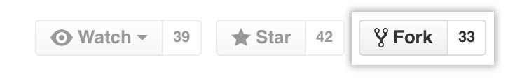

# vektor

<div align='center'>

[](https://www.javascript.com/)
[](https://react.dev/)
[](https://reactrouter.com/en/main)
[](https://nodejs.org/en)

[](https://www.chartjs.org/)


[](https://webpack.js.org/)

</div>

VEKTOR is a an application designed to allow users to log their glucose levels and blood pressure levels. With VEKTOR, the user can monitor their glucose trends throughout the day. 

## Features in progress
1. Incorporate meal log feature to provide insight on foods that may have caused glucose spikes.
2. Update About and Contact page

## Our team
  <table>
    <tr>
        <b>Elaine Wong<b> 
        <a href='https://github.com/user-byte123'>🐙 GitHub</a>
        <a href='http://www.linkedin.com/in/elainewongrph'>🖇️ LinkedIn</a>
      </td>
        <br />
        <b>King-Hur Wu<b>
        <a href='https://github.com/amrcnking'>🐙 GitHub</a>
        <a href='https://www.linkedin.com/in/king-hur-wu/'>🖇️ LinkedIn</a>
      </td>
      <br/>
        <b>Tanya Hang<b>
        <a href='https://github.com/tanyahang'>🐙 GitHub</a>
        </td>
      <br/>
        <b>Vicky Hoang<b>
        <a href='https://github.com/vkhoang'>🐙 GitHub</a>
        <a href='https://www.linkedin.com/in/vkhoang/'>🖇️ LinkedIn</a>
      </td>
    </tr>
  </table>

### Getting Started

To get started on running this application: 

  1. Fork the repo
    - click on the __Fork__ button on the top right of the page
    <br></img> 
    - click on your handle to fork to your repo
  
  2. Clone newly forked repo onto local machine
    - first, make sure you're on your new forked repo on GitHub
    - copy and paste GitHub url from the right side of the page
    <br></img>
    - enter the following line into your command line and insert your copied url instead of the quoted text:
      ```
      git clone 'copied url'
      ```
  3. Type 'npm run build' into command line

  4. Type 'npm run dev' into command line

#### Interface
- Overview
  - Upon application launch, the localhost will launch a login page, if you do not have a login, please click the signUp button.
  - Fill out the signUp form and click submit, then login with new username. This should bring you to your homepage
    <!-- <br></img> -->

  

